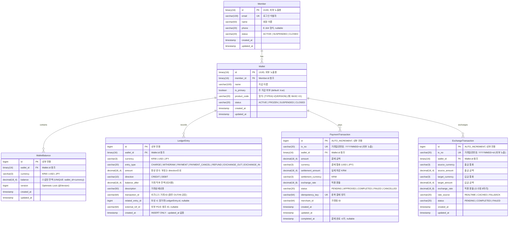

# LemonPay ERD

> 멀티통화 간편결제 시스템 - ERD 문서
> 버전: 1.2 | 최종 수정일: 2026-03-09 | 상태: 초안

---

## 도메인

### Member (회원)

- PK: UUID (`BINARY(16)`) — 외부 노출 ID. 순서/수량 추론 방지
- 논리 삭제: `status = CLOSED` (물리 삭제 없음)
- 휴대폰 번호:
  - 저장: `+821012345678` (E.164 국제 표준)
  - 표시: `010-1234-5678` (표현 계층에서 포맷)

### Wallet (지갑)

- PK: UUID (`BINARY(16)`) — 외부 노출 ID. 순서/수량 추론 방지
- Member와 현재 1:1, 향후 1:N 확장 고려
- `is_primary`: 주 지갑 여부 (default: true). 1:N 전환 시 기본 지갑 식별용
- `product_code`: 형식 `{TYPE4}-V{VERSION}` (예: `BASC-V1`). ISO 20022 스타일 4자리
  - 향후 `wallet_product` 테이블로 분리 예정 (현재 A안: 컬럼만 유지)

### WalletBalance (지갑 잔액)

- PK: BIGINT — 내부 전용
- `UNIQUE(wallet_id, currency)` — 한 지갑에 같은 통화 잔액이 두 개 생기면 안 됨
- `balance DECIMAL(18,4)` — 스냅샷 잔액 (성능용). 진실의 근원은 LedgerEntry
- `version BIGINT` — Optimistic Locking (@Version). 동시 수정 충돌 감지

### LedgerEntry (원장 내역)

- PK: BIGINT — 내부 전용
- **INSERT ONLY** — UPDATE/DELETE 금지. 수정은 보상 항목(compensating entry)으로
- `amount DECIMAL(18,4)` — 항상 양수. 부호는 `direction`으로 분리
- `direction` — CREDIT(+) / DEBIT(-). amount와 분리하여 의미 명확화
- `balance_after DECIMAL(18,4)` — 이 항목 처리 직후 잔액. 대사(Reconciliation)용
- `transaction_id VARCHAR(64)` — 비즈니스 거래 ID. 환전 시 EXCHANGE_OUT/IN이 동일 ID 공유
- `updated_at` 없음 — INSERT ONLY이므로 불필요

### PaymentTransaction (결제 거래)

- PK: BIGINT AUTO_INCREMENT — 내부 전용
- `tx_no VARCHAR(20) UNIQUE` — 외부 노출용 거래일련번호. 형식: `{YYYYMMDD}{id:08d}` (예: `2026030800000001`). 앱 레이어에서 생성
- `idempotency_key UNIQUE` — 중복 결제 방지. 24시간 유효
- `settlement_amount DECIMAL(18,4)` — 실제 차감된 KRW 금액
- `exchange_rate DECIMAL(18,8)` — 적용된 환율 (소수점 8자리)
- `completed_at` — 결제 완료 시각 (nullable). 처리 시간 측정용

### ExchangeTransaction (환전 거래)

- PK: BIGINT AUTO_INCREMENT — 내부 전용
- `tx_no VARCHAR(20) UNIQUE` — 외부 노출용 거래일련번호. 형식: `{YYYYMMDD}{id:08d}`. 앱 레이어에서 생성
- `exchange_rate DECIMAL(18,8)` — 환율은 소수점 8자리 필요
- `rate_source` — REALTIME / CACHED / FALLBACK. 사후 정산 및 감사 추적용
- `source_amount`, `target_amount` — 각각 DECIMAL(18,4). 환전 전/후 금액

---

## ERD

---

## 인덱스 전략

> 인덱스는 "어떤 쿼리가 자주 실행되는가"에서 출발한다.
> INSERT 빈도가 높은 테이블(LedgerEntry)은 인덱스를 최소화한다.

| 테이블 | 인덱스 | 종류 | 선정 이유 | 관련 요구사항 |
|--------|--------|------|---------|-------------|
| `member` | `email` | UNIQUE | 로그인 시 이메일로 조회. 중복 가입 방지 | FR-401 |
| `wallet` | `member_id` | UNIQUE | 회원의 지갑 단건 조회. 현재 1:1 관계 | FR-001 |
| `wallet_balance` | `(wallet_id, currency)` | UNIQUE | 특정 통화 잔액 조회 + 중복 방지 | FR-002 |
| `ledger_entry` | `(wallet_id, currency, created_at DESC)` | 복합 | 거래 내역 최신순 조회. 1천만 건 이상에서도 성능 보장 | FR-005, NFR-302 |
| `payment_transaction` | `tx_no` | UNIQUE | 거래일련번호 외부 조회 | - |
| `payment_transaction` | `idempotency_key` | UNIQUE | 중복 결제 방지 | FR-105 |
| `payment_transaction` | `(wallet_id, created_at DESC)` | 복합 | 지갑별 결제 내역 최신순 조회 | FR-005 |
| `exchange_transaction` | `tx_no` | UNIQUE | 거래일련번호 외부 조회 | - |
| `exchange_transaction` | `(wallet_id, created_at DESC)` | 복합 | 지갑별 환전 내역 최신순 조회 | FR-005 |

### 인덱스 설계 원칙

1. **LedgerEntry INSERT 빈도 고려** — 모든 거래마다 INSERT가 발생하므로 인덱스 수를 최소화. `(wallet_id, currency, created_at)` 복합 인덱스 하나로 대부분의 조회 패턴 커버
2. **UNIQUE 제약 = 인덱스 겸용** — `email`, `member_id`, `(wallet_id, currency)`, `idempotency_key`는 UNIQUE 제약이 자동으로 인덱스 역할
3. **created_at DESC** — 거래 내역은 항상 최신순 조회이므로 내림차순 정렬 포함
4. **transaction_id 인덱스 미적용** — `(wallet_id, currency, created_at)` 복합 인덱스로 대부분 조회 가능. 개별 추가 시 INSERT 오버헤드 대비 효과 미미
5. **status 단독 인덱스 미적용** — 카디널리티 낮음(5개 상태). 실제 조회는 wallet_id 기반이므로 별도 인덱스 불필요. 필요 시 추후 추가
