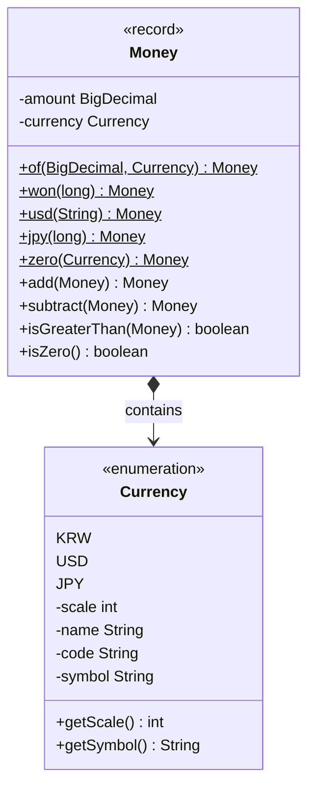
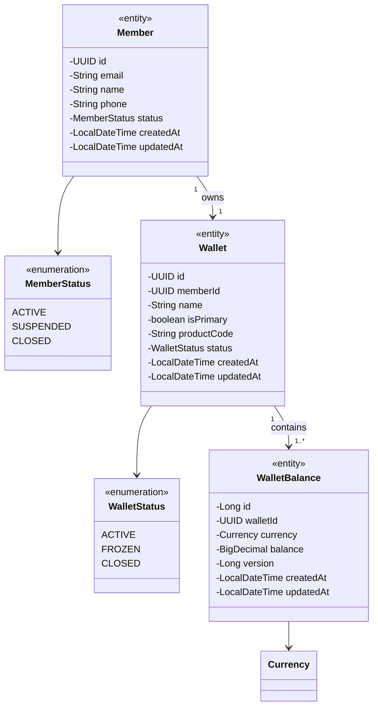
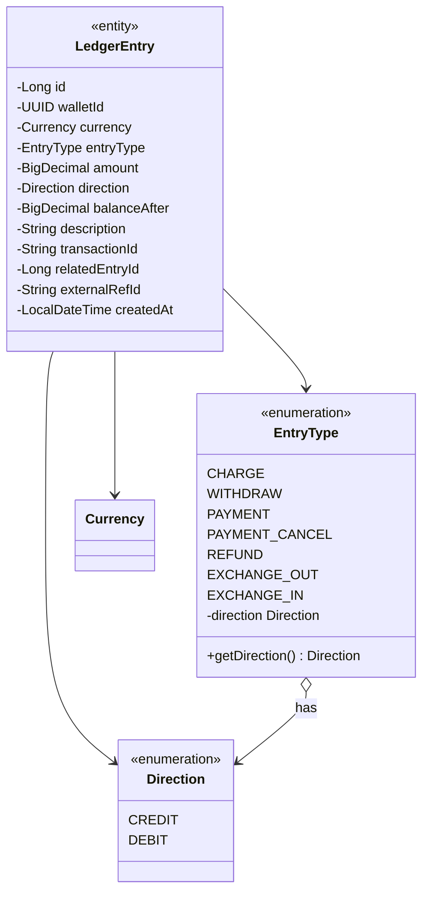
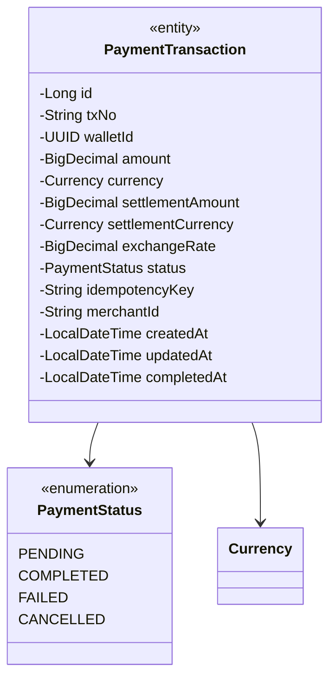
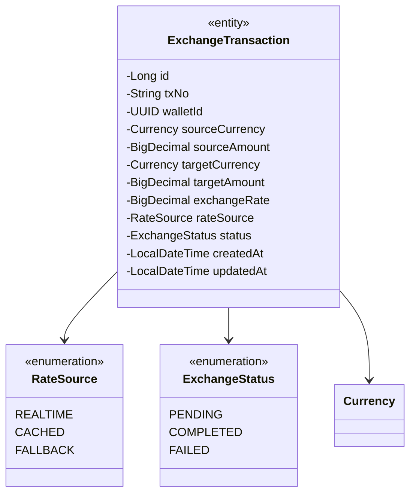
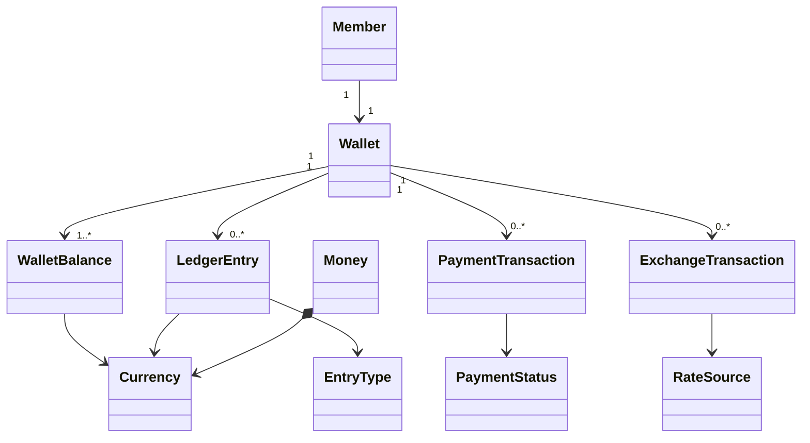

# LemonPay 도메인 클래스 다이어그램

> 버전: 1.0 | Sprint 1 기준 | 최종 수정: 2026-03-28
> 코드 변경 시 Sprint 종료 시점에 업데이트

---

## 1. Common (공유 VO)

---

## 2. Wallet Context

---

## 3. Ledger Context

---

## 4. Payment Context

---

## 5. Exchange Context

---

## 6. 전체 관계도

---

## 7. 추적 매트릭스

| 클래스 | 관련 FR | ERD 테이블 | 핵심 불변 조건 |
|--------|---------|-----------|--------------|
| Money | FR-204 | DECIMAL(18,4) | 음수 불가, 통화별 scale |
| WalletBalance | FR-002, FR-003 | wallet_balance | balance ≥ 0, @Version (Optimistic Lock) |
| LedgerEntry | FR-003 | ledger_entry | INSERT-only, balance_after 기록 필수 |
| PaymentTransaction | FR-101~105 | payment_transaction | 상태 머신, idempotency_key 중복 방지 |
| ExchangeTransaction | FR-201~204 | exchange_transaction | 단일 트랜잭션에서 EXCHANGE_OUT/IN 쌍 생성 |
| Member | FR-001 | member | 논리 삭제 (status=CLOSED) |
