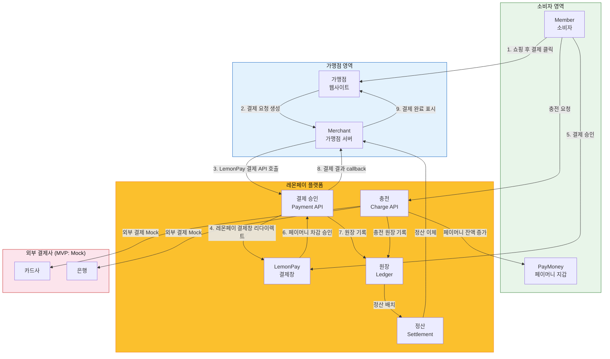
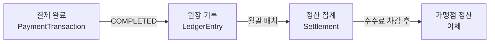

# LemonPay MVP 결제 흐름

> 멀티통화 간편결제 시스템 - 결제 흐름 설계 문서
> 버전: 1.2 | 최종 수정일: 2026-04-30 | 상태: 확정

#### 이력관리
- *LemonPay PM Agent | 결제 흐름 설계 v1.0 | 2026-04-25* <br>
- *Junoade | 결제 흐름 범위 확정 v1.1 | 2026-04-29*
- *Junoade | MVP 범위 정리 v1.2 | 2026-04-30*

---

## 1. MVP 개념 요약

### 핵심 설계 철학
> "소비자는 레몬페이 선불충전금을 충전해두고, 가맹점의 리다이렉트된 레몬페이 결제창에서 결제를 승인 요청하는 구조."

LemonPay는 소비자(Member)와 가맹점(Merchant) 사이에 위치하는 **간편결제 플랫폼**이다. <br/>
소비자는 충전된 멀티통화 페이머니를 사용해 레몬페이 결제창에서 결제할 수 있고, 가맹점은 레몬페이 API를 통해 결제 요청과 결과 수신을 처리한다.<br/>
결제수단 토큰화 및 카드/계좌 직접 결제는 향후 확장 범위로 분리한다.

**핵심 가치**:
- 결제수단 토큰화는 향후 확장 범위로 분리
- 멀티통화 페이머니(선불충전금)로 미리 환전 후 글로벌 가맹점에서 결제
- 가맹점은 결제 요청과 결과 수신에 집중하고, 결제 처리와 정산은 레몬페이가 담당

---

## 2. 참여자 (Actor) 정의

| 참여자 | 정의 | 레몬페이와의 관계 |
|--------|------|-----------------|
| **Member (소비자)** | 레몬페이에 가입한 일반 사용자. 충전된 페이머니로 레몬페이 결제창에서 결제함 | 고객 |
| **Merchant (가맹점)** | 온라인 쇼핑몰 등 레몬페이 API를 연동한 사업자. 결제 요청 생성 및 결제 결과 수신 | B2B 파트너 |
| **LemonPay** | 결제 세션 생성, 결제 승인 처리, 원장 기록, 가맹점 정산을 담당하는 플랫폼 | 플랫폼 |
| **외부 결제사** | 카드사 / 은행 등. 충전 시 실제 자금 이동을 처리하는 외부 시스템 (MVP에서는 Mock으로 대체) | 외부 의존성 |

---

## 3. 시스템 전체 흐름 다이어그램



---

## 4. 결제수단 및 충전 확장 범위

> 결제수단 토큰화, PaymentMethod 도메인, 카드/계좌 직접 결제는 현재 MVP 구현 범위에서 제외한다.<br/>
> 현재 MVP에서는 페이머니 결제 흐름과 외부 결제 Mock 기반 충전에 집중한다.<br/>
> 상세 확장 방향은 아래 문서를 참조한다.

- 결제수단 도메인: `docs/extension/01-payment-method-design.md`
- 가맹점 API 확장: `docs/extension/02-merchant-api-design.md`
- 결제수단 기반 충전 확장: `docs/extension/03-payment-method-based-charge.md`

---

## 5. 페이머니 (PayMoney) 개념

### 5.1 페이머니란

페이머니는 **레몬페이 선불충전금**이다. 카카오페이의 카카오페이머니, 네이버페이의 네이버페이포인트와 동일한 개념이다.

```
선불충전금 개념도

   카드/계좌 ────충전────► 페이머니(KRW) ────환전────► 페이머니(USD/JPY)
                                │
                                └────결제────► 가맹점
```

### 5.2 타사 간편결제 시스템 비교

| 결제수단 | 돈의 흐름 | 정산 주체 | LemonPay 대응 |
|---------|---------|---------|--------------|
| 카드 결제 | 소비자 → 카드사 → PG → 가맹점 | 카드사 | 카드로 페이머니 충전 후 결제 |
| 계좌이체 | 소비자 → 은행 → PG → 가맹점 | PG | 계좌로 페이머니 충전 후 결제 |
| 페이머니 | 소비자 충전금 → PG → 가맹점 | 간편결제사 (카카오/네이버) | LemonPay가 직접 정산 |
| 증권계좌 | 소비자 → 증권사 → PG → 가맹점 | PG | MVP 범위 외 |

### 5.3 멀티통화 페이머니

LemonPay의 차별점은 **다통화 페이머니**이다.
KRW/USD/JPY 각각 독립적인 잔액을 보유하며, 통화 단위는 페이머니의 화폐 단위다.

```
멀티통화 페이머니 구조

Member (회원)
  └── Wallet (지갑)
        ├── WalletBalance (KRW 잔액): ₩50,000
        ├── WalletBalance (USD 잔액): $100.00
        └── WalletBalance (JPY 잔액): ¥5,000
```

- KRW 페이머니: 국내 가맹점 결제 / 환전 재원
- USD 페이머니: 해외(달러 결제) 가맹점 직접 결제
- JPY 페이머니: 해외(엔화 결제) 가맹점 직접 결제

---

## 6. 핵심 API 기능 개요

### 6.1 현재 MVP 핵심 API

| 항목 | 내용 |
|------|------|
| 가맹점 결제 요청 | `POST /api/v1/payments` |
| 결제 승인 | `POST /api/v1/payments/approve` |
| 페이머니 충전 | `POST /api/v1/wallets/{walletId}/charge` |
| 관련 FR | FR-004, FR-101~105 |

### 6.2 향후 확장 API

> 아래 항목은 현재 MVP 본 구현 범위에서는 제외한다.

- 가맹점 API Key 발급 및 인증
- 가맹점 결제/정산 이력 조회 API
- 결제수단 등록/조회/삭제 API
- 결제수단 토큰 기반 충전 API

상세 초안은 `docs/extension` 하위 문서에서 관리한다.

---

## 7. 가맹점 정산 개요

> 상세 정산 설계는 `08-merchant-settlement.md` 참조



- 정산 주기: 월말 (MVP 기준)
- 수수료: 결제 금액의 1.5% (MVP 고정)
- 정산 단위: 가맹점별, 통화별

---

## 8. DDD 관점에서의 도메인 확장

현재 MVP 구현 기준으로 기존 도메인에 다음이 추가된다.

```
기존 도메인
├── Member (회원)
└── Wallet (지갑) + WalletBalance + LedgerEntry

신규 추가 도메인 (MVP 확정)
├── Merchant (가맹점)
├── PaymentTransaction (결제 거래)
└── ExchangeTransaction (환전 거래)
```

| 신규 Aggregate | 루트 엔티티 | 불변 조건 |
|--------------|-----------|---------|
| **Merchant** | Merchant | ACTIVE 가맹점만 결제 요청 가능 |
| **PaymentTransaction** | PaymentTransaction | 결제 상태 전이, 가맹점/지갑 연관, 정산 대상 식별 |

> `Settlement` Aggregate 및 가맹점 API Key 도메인은 후속 확장 범위로 분리한다.
