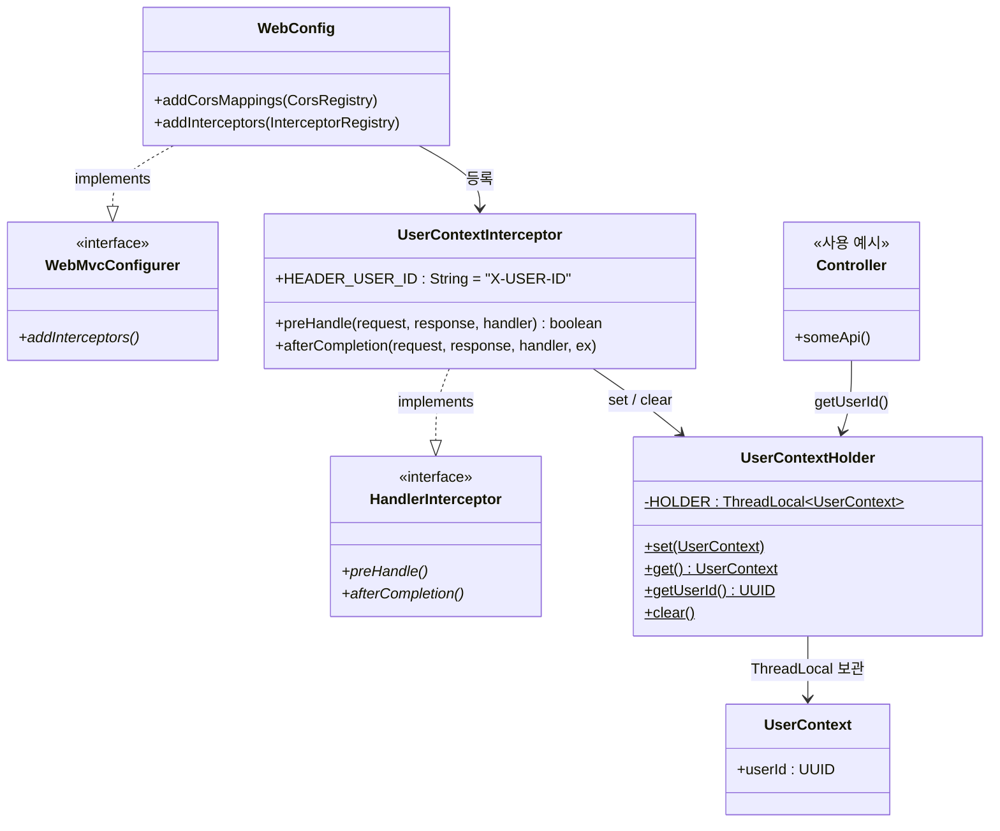

# ADR-001 Auth Design

## 1. 상태
- 결정완료

## 2. 컨텍스트
- 과제 범위에서는 회원/지갑/결제/환전 도메인 흐름 검증이 우선이다.
- 본 과제 단계에서는 완전한 인증 체계(JWT, OAuth2, 세션)를 구현하지 않는다.
- 대신 API 호출 주체를 식별할 수 있는 최소한의 방식이 필요하다.
- 추후 JWT 기반 인증으로 확장 가능해야 한다.

## 3. 결정

- 현재 과제에서는 `X-USER-ID` 헤더 기반의 간이 사용자 식별 방식을 사용한다.
- 이 헤더는 과제 및 로컬/개발 환경에서 테스트 편의성을 위한 임시 수단으로 사용한다.
- 애플리케이션은 `X-USER-ID`를 요청 컨텍스트에 바인딩하고, 리소스 소유자 확인 등 인가성 검증에 활용한다.
- 운영 수준의 인증/인가 보안은 본 ADR의 범위에 포함하지 않는다.
- 추후 인증 체계 도입 시에는 `UserContext`를 유지한 채, 헤더 파싱 부분을 JWT 또는 인증 필터 기반으로 교체한다.

### 객체 협력

## 4. 결과
- 인증 구현 복잡도를 낮추고, 과제 범위 내에서 도메인 검증에 집중할 수 있다.
- Controller/Application 계층은 인증 방식과 분리된 형태로 사용자 식별값을 사용할 수 있다.
- 추후 JWT 기반 인증으로 전환할 때 인터셉터/필터 계층 중심으로 변경 범위를 제한할 수 있다.

## 5. 한계
- `X-USER-ID` 방식은 테스트 및 과제용 임시 전략이며, 운영 환경에 직접 적용할 수 없다.
- 헤더 위변조 방지, 토큰 만료, 권한(Role/Scope), 재인증 정책 등은 다루지 않는다.
- 실제 서비스 단계에서는 Spring Security + JWT 또는 별도 Auth Server 기반 구조로 대체해야 한다.
