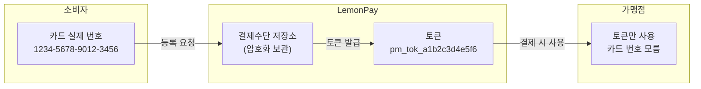

# 부록 1. MVP 외 확장 설계 - 결제수단 도메인

### 1-1. 저장 방식, 토큰화

소비자가 카드 번호를 가맹점마다 입력하는 방식은 보안 위험이 큼.

레몬페이는 결제수단 원본 정보를 한 곳에서 안전하게 관리하고, 가맹점에는 **토큰**만 전달한다.


---

### 1-2. 결제수단 데이터 모델 (향후 확장 방향)

> 결제수단(PaymentMethod) 엔티티는 현재 MVP 구현 범위에서는 제외한다.
> 향후 카드/계좌 직접 결제 및 결제수단 재사용 기능 확장 시 별도 도메인으로 추가한다.

```
PaymentMethod (결제수단)
├── id: UUID (외부 노출 ID)
├── memberId: UUID (Member.id)
├── type: CARD | ACCOUNT
├── token: String (암호화된 원본 식별자)
├── displayName: String (예: "신한카드 1234")
├── isDefault: Boolean (기본 결제수단 여부)
├── status: ACTIVE | DELETED
├── createdAt: Timestamp
└── updatedAt: Timestamp
```
---

### 1-3. 결제수단 주요 API

| 항목 | 내용 |
|------|------|
| 목적 | 카드/계좌를 레몬페이에 등록 및 토큰 발급 |
| 주요 엔드포인트 | POST /api/v1/payment-methods |
| 조회 | GET /api/v1/payment-methods |
| 삭제 | DELETE /api/v1/payment-methods/{id} |
| 관련 FR | FR-P01~P03 (신규, 01-requirements.md 섹션 6 참조) |